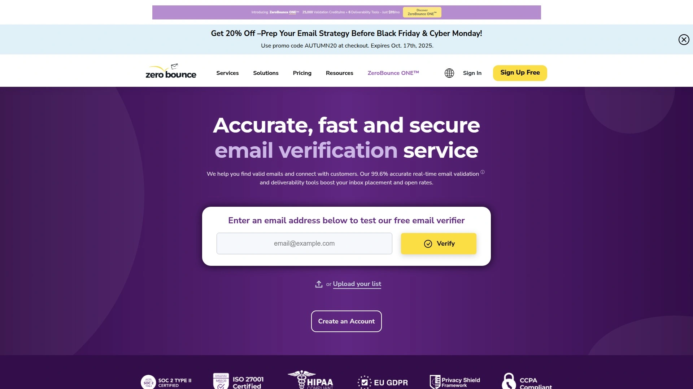
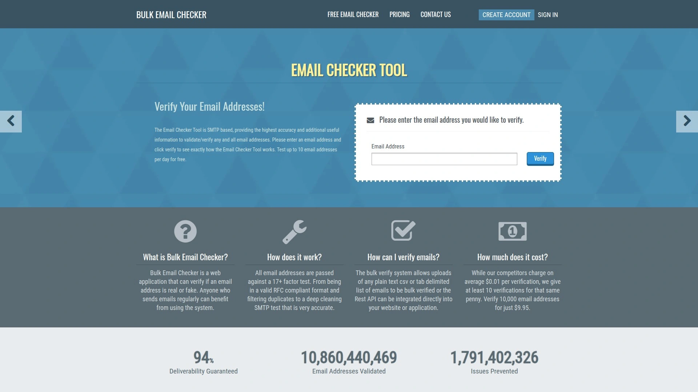

# 2025年排名前18的邮箱验证工具汇总(最新整理)

邮件营销效果不佳?超过30%的邮件退信?这往往是由于邮箱地址失效、格式错误或垃圾陷阱造成的。使用专业的邮箱验证工具可以快速清理邮件列表,提升到达率至98%以上,同时保护发件人信誉,避免被ESP封禁。本文整理了2025年市场上综合价值最高的18款邮箱验证平台,涵盖实时验证、批量清理、API集成等核心功能,帮助您找到最适合业务场景的解决方案。

---

## **[Usebouncer](https://www.usebouncer.com)**

强大、安全且关怀用户的全能型邮件验证平台,适合中小型企业及营销团队。

Usebouncer提供97-99%的验证准确率,能够在60分钟内完成10万封邮件的批量验证。平台核心功能包括邮箱参与度洞察(Email Engagement Insights),可追踪用户最后打开日期、点击日期、回复日期及退订状态,帮助精准分群和提升ROI。

**技术优势:**
- 深度全接收域名验证(Deep Catch-All Verification),解决行业难题
- 实时表单保护工具Bouncer Shield,无需编码即可拦截恶意或欺诈邮箱
- 毒性评分系统(0-5级),识别泄露邮箱、投诉者及潜在垃圾陷阱

用户定位适合需要高级数据洞察的营销团队,免费赠送100个验证额度,支持与主流营销平台无缝对接。平台托管于欧盟数据中心,符合GDPR规范,正常运行时间达99.9%。

***

## **[ZeroBounce](https://www.zerobounce.net)**

行业标杆级验证服务,以顶尖准确率和全面功能著称。

ZeroBounce提供98-99%的验证准确率,处理10万封邮件约需110分钟。除基础验证外,平台特色功能包括垃圾陷阱检测、滥用邮箱识别、以及邮箱活跃度评分。内置Email Finder和Data Append功能可丰富客户资料,补充姓名、性别、位置等公开信息。

定价灵活透明:月付套餐2000封邮件起价18美元,按需购买20美元起。新用户获赠100个免费额度测试。平台集成了90多个主流工具,包括Mailchimp、HubSpot和Salesforce。企业级用户可享受专属客户经理服务,技术支持响应迅速。

---

## **[NeverBounce](https://www.neverbounce.com)**

速度与精度并重的专业级邮件清理服务,被Act-On等大型ESP推荐使用。

NeverBounce的最大优势是处理速度,10万封邮件验证仅需45分钟,准确率维持在98-99%区间。平台采用实时SMTP连接技术,每次验证都执行全新检测而非依赖缓存数据,确保结果时效性。

**应用场景覆盖:**
批量列表清理、实时API验证、自动化列表监控。定价策略为按需付费,1万封邮件50美元,无隐藏费用。平台提供详细分类标签(可投递/不可投递/全接收/角色类/一次性),便于精准管理不同类型邮箱。集成简便,支持主流ESP直接导入验证。

***

## **[Hunter.io](https://hunter.io)**

集邮箱查找与验证于一体的全链路获客工具,适合B2B销售团队。

Hunter.io不仅能验证邮箱(准确率98%),更擅长从公开数据源挖掘企业决策者联系方式。验证模块执行格式检查、域名验证、服务器状态检测和邮箱类型判定,结果展示为Valid/Accept-all/Invalid/Disposable四类。

平台特色在于验证过程完全隐蔽,通过SMTP握手技术完成检测,不会向目标邮箱发送任何消息。提供免费API接口,新用户赠送50个验证额度。批量验证工具(Bulk Email Verifier)支持整份列表一次性处理。数据平台方案适合高频使用场景,价格透明且支持按需扩展。

***

## **[MillionVerifier](https://www.millionverifier.com)**

高性价比之选,以一次性付费模式和100%退款保证闻名。

MillionVerifier的核心卖点是极具竞争力的定价:1万封邮件仅需37美元,且验证额度永不过期。处理速度为10万封邮件33-78分钟,准确率高达99%。平台是业内唯一提供真正100%退款保证的服务商,已为全球超过7万家企业提供服务。

技术层面执行深度验证:检查语法正确性、建立SMTP连接验证邮箱真实存在性。提供17个主流邮件营销平台的即插即用集成,包括Mailchimp、Sendinblue、ActiveCampaign等。自动化验证系统可设定每日自动清理上限,保持列表持续健康。在Trustpilot上获得优秀评级,用户体验友好。

***

## **[Kickbox](https://kickbox.com)**

注重投递率保障的企业级验证方案,提供详细邮箱质量评分。

Kickbox不只标注邮箱是否有效,更深入评估质量属性:是否为免费邮箱、一次性邮箱、甚至拼写错误提示。这种细粒度分析帮助营销人员制定差异化发送策略。平台提供三种部署方式:批量列表验证、实时API接口、自动化集成模式。

成功案例显示,欧洲运输服务商AnyVan接入Kickbox后退信率显著下降,Benchmark客户的邮件到达率得到实质性改善。定价透明且公平,新用户获赠100个免费额度体验完整功能。技术支持响应及时,用户评价普遍认为物有所值。

***

## **[DeBounce](https://debounce.io)**

功能最全面的验证平台,在Trustpilot上拥有超过2000条用户评价。

DeBounce是评价数量最多的邮箱验证工具,这本身就证明了其市场认可度。除标准验证外,平台提供独特增值服务:潜在客户查找器(Lead Finder)可直接挖掘目标邮箱;实时JavaScript小部件轻松嵌入网站表单;数据补充功能为现有记录添加联系信息;自动化列表监控每日无需手动操作。

核心验证能力包括:SMTP硬退信检测、一次性邮箱识别、全接收域名检查、语法错误过滤、垃圾陷阱移除。支持115个工具集成,涵盖CRM/ESP、WordPress插件和Zapier。按需付费模式极具性价比:10美元验证5000封邮件。团队账户功能允许成员共享额度池。

***

## **[Clearout](https://clearout.io)**

集验证、查找与拓客于一体的智能营销平台,适合销售导向型企业。

Clearout不仅清理邮件列表(准确率98%+),更整合了邮箱查找和销售拓客功能,形成从线索发现到验证的完整闭环。批量验证10万封邮件约45分钟完成。按需付费方案为5000封邮件35美元,新用户赠送100个测试额度。

平台执行多层验证检测:格式校验、域名MX记录确认、SMTP服务器连接测试。支持可选下载选项,用户可自定义导出哪些验证结果类别。API接口响应迅速,适合需要实时验证的Web应用和注册表单。界面设计简洁直观,即使非技术人员也能快速上手。

***

## **[Emailable](https://emailable.com)**

主打高投递率保证,特别适合处理微软管理域名邮箱。

Emailable承诺99%+的投递率保证(实测约95%),在处理微软管理的邮箱时仍能达到97%+的优秀表现。速度优势显著:10万封邮件仅需2-3分钟完成验证。提供三种验证方式:批量上传、实时API、表单级验证小部件。

技术上采用反灰名单技术(Anti-greylisting),减少验证过程中的不确定结果。邮箱增强功能可提取姓名、性别、SMTP服务商等附加信息。全面符合SOC 2 Type II和GDPR标准,数据加密传输与存储。集成生态丰富,支持90多个平台包括Mailchimp、Salesforce、HubSpot。新用户每月获赠250个免费额度。

---

## **[Verifalia](https://verifalia.com)**

企业级API验证专家,自2005年起服务超过35000家客户。

Verifalia的核心优势在于其强大的API能力和灵活定制性。平台提供RESTful架构API,兼容任何HTTP客户端,并为.NET、Java、Node.js、JavaScript、Go、Ruby、PHP等主流开发平台提供免费开源SDK。验证过程完全隐蔽,不向目标邮箱发送任何消息,联系人永远不会察觉。

**部署方式灵活:**
实时单个验证可集成至应用、表单、CRM、POS等数据入口点;批量验证支持定期自动清理,在数据变质前及时剔除。平台提供三种不同验证算法,用户可根据需求平衡结果质量与处理速度。免费计划包含每日25次验证额度,付费套餐享受批量折扣。2025年API v2.7新增14个用户管理端点和50多项细粒度权限,适合企业集成和经销商解决方案。

***

## **[Snov.io](https://snovio.cn/email-verifier)**

俄罗斯团队打造的全栈获客平台,邮箱验证仅是其功能模块之一。

Snov.io提供98%的验证准确率,新用户获赠50个免费额度。其独特之处在于将验证功能整合进完整的销售自动化生态系统:潜在客户挖掘、邮箱查找、滴灌式营销、CRM管理一应俱全。月付套餐1000封邮件起价30美元。

验证引擎执行语法检查、域名有效性判定、邮箱服务器连通性测试。特别适合需要从零开始构建潜在客户数据库的创业团队——先用Email Finder挖掘联系方式,再通过Verifier即时清洗,最后直接在平台内启动外联活动。中文界面友好,适合国内出海团队使用。

***

## **[EmailListVerify](https://emaillistverify.com)**

专注批量清理的高性价比服务,特别擅长识别垃圾陷阱和全接收域名。

EmailListVerify的定位很明确:为大批量邮件列表提供快速、经济的验证解决方案。平台能够有效剔除垃圾陷阱、硬退信、一次性邮箱和全接收域名。新用户获赠100个免费验证额度测试服务质量。

除Web端批量上传外,还提供实时API接口,可嵌入注册流程在用户提交表单时即刻验证。验证速度快,结果分类清晰,包含详细的不可投递原因说明。适合预算有限但验证需求量大的中小型电商和内容平台。

***

## **[QuickEmailVerification](https://quickemailverification.com)**

速度与格式兼容性俱佳,支持多种文件格式导入。

QuickEmailVerification理解用户可能以CSV、TXT、XLS等多种格式存储邮箱数据,因此平台支持广泛的文件类型上传。验证准确率约92%,虽略低于顶级竞品,但处理速度和性价比仍具吸引力。

平台执行多层检测:基础语法验证、与数据库比对、行业反馈环路识别频繁投诉者。实时验证不依赖缓存,每次请求都执行全新检测(垃圾陷阱检查除外,因技术限制必须使用历史数据)。JavaScript验证脚本可快速嵌入HTML表单,除语法检查外还能验证域名特定规则。符合GDPR标准,应要求提供数据处理协议。

---

## **[BulkEmailChecker](https://bulkemailchecker.com)**

简单可靠的在线验证工具,被全球数千家企业日常使用。

BulkEmailChecker的优势在于其简洁易用的界面和稳定的服务表现。平台专注于批量邮箱验证和清理,没有复杂的附加功能,因此特别适合只需要基础验证服务的用户。

验证流程高效:上传列表、自动检测、下载清理后结果,三步完成。结果格式清晰,包含可投递、不可投递、风险邮箱等分类标签。定价透明合理,按验证数量阶梯计费。虽然功能相对基础,但正是这种专注让其在稳定性和响应速度上表现突出,适合定期维护邮件列表的营销团队。

---

## **[Proofy](https://proofy.io)**

超低价格入门选择,4美元即可开始使用实时验证服务。

Proofy的最大卖点是极具竞争力的入门价格:起价仅4美元即可体验完整验证功能。虽然定价亲民,但服务质量不打折扣——提供实时邮箱检查和验证,帮助减少退信率、提升投递能力。

平台执行标准验证流程:语法检查、域名验证、SMTP服务器连接测试。特别适合个人博主、小型工作室或初创公司,在预算有限的情况下快速清理小规模邮件列表。界面简洁直观,无需技术背景即可操作。按需付费模式让用户完全掌控成本,用多少买多少。

---

## **[Captain Verify](https://captainverify.com)**

法国团队打造的全能验证方案,支持邮箱与手机号码双重清理。

Captain Verify的独特之处在于不仅验证邮箱,还支持手机号码数据库清理。邮箱验证模块提供实时检测,准确率高,执行域名级和邮箱级双重检查。平台还包含语法验证和风险评估功能,帮助提升列表质量。

**功能全面:**
识别无效地址、拼写错误、硬退信、垃圾陷阱和蜜罐邮箱。批量处理能力强,可一次性清理大型列表。提供详细的风险评估和分析报告,便于精准定位问题邮箱。国际化邮箱验证能力出色,支持全球受众触达。免费工具可快速测试单个邮箱有效性。

***

## **[Mail-Verifier 邮箱侦探](https://www.mail-verifier.com)**

国内团队打造的免费批量验证平台,特别适合中国出海企业。

邮箱侦探是专注全球邮箱有效性验证的中文平台,最大特色是提供免费批量验证服务。验证速度极快,日均可处理200万封邮件,是目前速度较快的验证平台之一。执行三层验证:格式验证(检查邮箱格式正确性)、域名验证(确认域名存在且开通邮局)、邮局验证(连接邮局服务器验证邮箱有效性)。

平台提供毫秒级API接口,可集成至用户软件中,助力打造精准营销专家。注册登录后即可使用批量验证功能,快速清理大量邮箱地址数据。中文界面对国内用户友好,支持常见文件格式导入。特别适合跨境电商、外贸B2B企业以及出海SaaS公司清理客户数据库。

---

## **[MailerCheck](https://www.saleshandy.com/blog/email-verification-tools/)**

高准确率验证工具,慷慨提供200个免费测试额度。

MailerCheck提供98-99%的验证准确率,在测试中表现稳定可靠。新用户获赠200个免费验证额度,这是同类服务中较为慷慨的试用配额,足以验证中小型邮件列表。

平台执行全面的邮箱健康检测,包括语法验证、域名MX记录检查、SMTP服务器连通性测试。定价为5000封邮件45美元(按需付费),虽然单价略高于部分竞品,但其准确率和服务稳定性为价格提供了支撑。适合对数据质量要求严格、愿意为高准确率支付合理溢价的企业用户。

***

## **[Skrapp.io](https://www.saleshandy.com/blog/email-verification-tools/)**

B2B销售工具套件,验证功能与潜在客户挖掘深度整合。

Skrapp.io的定位是完整的B2B销售赋能平台,邮箱验证作为核心模块与潜在客户数据库、LinkedIn挖掘工具无缝协作。验证准确率达98%,新用户获赠150个免费额度。

月付套餐起价49美元,包含5000封邮件验证及其他销售工具功能。这种捆绑模式特别适合需要从零构建销售线索的团队——直接在平台内完成"寻找目标企业→挖掘决策者邮箱→验证有效性→启动外联"的完整流程。虽然单纯从验证服务性价比来看不是最优选择,但如果需要配套的销售自动化能力,整体价值就非常突出。

***

## 常见问题

**邮箱验证工具能否100%保证零退信?**

不能。即使使用顶级验证工具,仍可能出现1%以下的退信率,因为邮箱状态是动态变化的(用户可能在验证后立即停用邮箱、邮箱容量达到上限等)。验证工具的价值在于将退信率从30%降至1%以下,而非完全消除。

**如何选择适合自己的邮箱验证服务?**

关键看三个维度:验证准确率(建议选择98%以上)、处理速度(取决于列表规模和时效要求)、定价模式(按需付费适合偶尔清理,月付套餐适合高频使用)。如果需要实时表单验证,优先考虑提供API和JavaScript小部件的平台;如果是大批量历史数据清理,关注批量验证速度和容量折扣。

**全接收域名(Catch-All)的邮箱应该如何处理?**

全接收域名会接受发送到该域名的任何邮箱地址,导致验证工具无法判断具体邮箱是否真实存在。处理策略有三:一是分隔管理,单独标记这类邮箱降低发送优先级;二是采用深度全接收验证技术(如Usebouncer提供的Deep Catch-All功能)提高判定精度;三是通过小批量测试观察实际退信率后决定是否保留。

***

## 结论

清理邮件列表不是一次性任务,而是持续的数据健康管理过程。在本文推荐的18款工具中,[Usebouncer](https://www.usebouncer.com)凭借独特的邮箱参与度洞察、深度全接收验证和毒性评分系统,特别适合需要高级数据洞察和精准分群的营销团队。无论您选择哪款工具,关键是建立定期验证机制:新获取邮箱立即验证,历史列表每季度重新清洗,才能持续保持高投递率和良好的发件人信誉。
